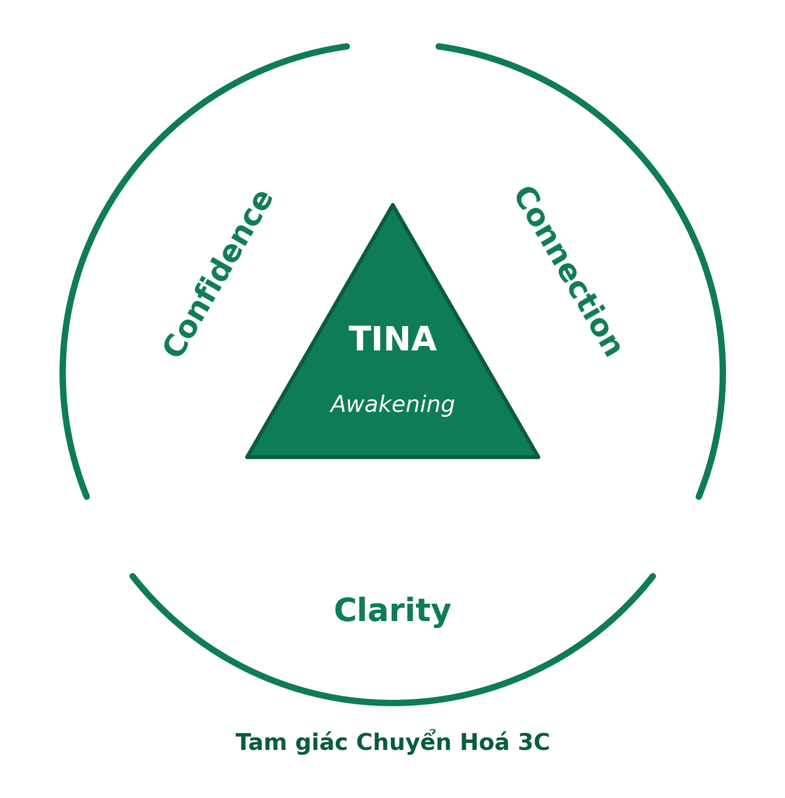

COACH EDINA TRÂM

Tham vấn Tâm lý · Khai vấn cuộc sống

90 NGÀY

CHUYỂN HOÁ

TINA AWAKENING

Chương trình Coaching & Mentoring 1:1 — 12 Module

Dành cho những ai đang đi tìm một hướng đi mới cho cuộc đời mình

T.I.N.A — Transformation Into New Awareness

# Thư ngỏ

Cảm ơn bạn đã có mặt ở đây.

Tôi không biết điều gì đã đưa bạn đến trang này — một đêm trằn trọc, một câu hỏi chưa có lời đáp, hay một khao khát thay đổi mà bạn còn chưa gọi thành tên. Nhưng tôi tin chắc một điều: bạn đang tìm kiếm điều gì đó lớn hơn hiện tại của mình. Một sự chuyển mình thật sự.

Và nếu bạn đã đọc đến đây, tôi tin bạn không chỉ muốn “dễ chịu hơn một chút”. Bạn muốn kiến tạo một cuộc sống mới.

> Không có gì là ngẫu nhiên.
> Việc bạn dừng lại ở đây, đọc đến tận dòng này,
> đã là một nhân duyên đẹp.

Trâm xin được đón bạn bằng tất cả sự trân trọng.

Tôi từng đứng đúng nơi bạn đang đứng, mang đúng những trăn trở bạn mang lúc này. Nên tôi hiểu — và tôi biết ơn vì bạn đã cho chúng ta cơ hội được kết nối.

Hôm nay, điều tôi mong mỏi là được trao lại phước lành mà chính Trâm đã may mắn nhận được trên hành trình của mình: sự hàn gắn (healing) và sáng tỏ (clarity) — cho những ai đang đi trong bóng tối mà vẫn khát khao một tia sáng ở cuối đường hầm.

# Tại sao tôi tạo ra hành trình này?

Trước khi đọc tiếp, xin bạn hãy dừng lại một nhịp và tự hỏi:

Vì sao mình cứ quay lại đúng chỗ bế tắc cũ — dù đã cố gắng, đã trị liệu, đã chữa lành, đã đọc bao nhiêu sách?

Tôi hỏi câu đó, vì chính tôi đã sống trọn vẹn với nó.

Từ một người thành công theo mọi chuẩn mực xã hội, tôi đi qua hai lần phá sản, một cuộc hôn nhân đổ vỡ, ba năm suy sụp cả thể chất lẫn tinh thần — và cảm giác mất kết nối hoàn toàn với chính cuộc đời mình. Tôi phải đứng dậy làm lại từ con số không.

> “Tôi không giỏi hơn bạn.
> Tôi chỉ vấp ngã trước bạn.”
> — Edina Trâm

Chính ở đáy sâu ấy, một sự thức tỉnh bắt đầu. Sau gần 5 năm gần như ẩn tu khỏi cuộc đời, tôi từng bước dựng lại đời sống tài chính vững vàng, sống Đời và Đạo song hành, và biến tất cả những gì mình đi qua thành một sứ mệnh phụng sự.

Dù bị cuộc đời vùi dập nhiều lần, tôi vẫn chọn giữ lại sự hồn nhiên và niềm tin trong sáng vào thiện căn con người. Tôi chọn buông xuống những gánh nặng, tha thứ cho những gì từng làm mình tổn thương — nhưng không đầu hàng trước những bài học của cuộc sống.

Ở lần làm lại này, tôi học được cách “đứng trên vai người khổng lồ”: đầu tư đúng vào những người thầy, những người khai vấn, dẫn dắt, để vực dậy nhanh hơn và tránh tổn hao nhiều công sức. Khoảnh khắc tôi mở lòng đón nhận những gì “đã có sẵn từ người khác” — thay vì mãi tự mò mẫm, thử sai — cũng là lúc quý nhân xuất hiện, đúng người, đúng thời điểm.

Đó là lý do hành trình này ra đời. Tôi tạo ra nó để trở thành người đồng hành mà chính tôi từng ao ước có được trong những ngày tăm tối nhất.

> “Tôi không chỉ truyền đạt lý thuyết chuyển hoá.
> Tôi đã đi qua đúng con đường mà bạn đang đi.”
> — Edina Trâm

## Đôi nét về Edina Trâm

Sinh năm 1983, cung Nhân Mã. Phong cách “thanh lịch, trí tuệ và ấm áp”.

“Điều thú vị ở Trâm không nằm ở một vài tấm bằng, mà ở chỗ rất ít người hội tụ cả bốn thế giới: Tâm lý học, Khai vấn, Tâm linh và Tài chính cùng một lúc.”

— trích lời chị Mai Hương, nguyên Giám đốc Nhân sự

Nền tảng chuyên môn

- Thạc sỹ Tâm lý học — Đại học Sư phạm Hà Nội.

- Thạc sỹ Tài chính Ngân hàng — University of Southampton, Anh Quốc.

- ICF Associate Certified Coach (ACC) — International Coaching Federation (ICF), Hoa Kỳ.

- ACCA — Hiệp hội Kế toán Công chứng Anh Quốc; nhiều năm kinh nghiệm tài chính tại các doanh nghiệp.

- Hơn 15 năm nghiên cứu và thực hành tâm linh, thiền định; thành thạo các công cụ chẩn đoán nhân mệnh như Tử Vi và Nhân số học.

- Hơn 20 năm sinh sống và làm việc tại 4 quốc gia (Anh, Singapore, Na Uy, Việt Nam);

- Học qua 4 trường đại học; sử dụng thành thạo 3 ngôn ngữ.

# Vì sao khủng hoảng cứ quay lại?

Có lẽ bạn đã thử nhiều cách. Bạn thấy nhẹ đi một thời gian, rồi mọi thứ lại lặng lẽ trở về như cũ. Bạn tự hỏi phải chăng mình chưa đủ cố gắng?

Tôi nói với bạn: không phải vậy.

Phần lớn thị trường hôm nay chỉ chữa cho bạn phần ngọn — coaching ngắn hạn cho nhanh, trị liệu tách rời đời sống thật, chữa lành chỉ dừng ở cảm xúc. Nỗi đau quay lại không phải vì bạn yếu, mà vì nền tảng sống bên trong bạn chưa được tái cấu trúc.

> Khủng hoảng cứ quay lại không phải vì bạn chưa đủ cố gắng,
> mà vì tiềm thức bên trong bạn chưa được chữa lành tận gốc.

## Tôi làm việc khác đi như thế nào?

Niềm tin cốt lõi của tôi đi xa hơn:

> Chuyển hoá chỉ bền vững khi ba tầng cùng thay đổi:
> Nhận thức được khai mở,
> Hành vi được làm mới,
> và Nghiệp lực — nhân cách sống — được hoá giải.

Tôi làm việc ngay tại giao điểm của Tâm lý học, Khai vấn, Tâm linh và Tài chính — để bạn chuyển hoá bền vững cả Đời lẫn Đạo, chứ không chỉ thấy nhẹ đi trong vài tuần.

> “Tôi không chỉ giúp bạn ổn hơn.
> Tôi giúp bạn thoát khỏi vòng lặp khiến bạn cứ quay lại bế tắc cũ.”
> — Edina Trâm

# Thế nào là một sự chuyển hoá thật sự?

Để bạn biết mình đang đặt cược 90 ngày vào điều gì, tôi nói thẳng: chuyển hoá không phải một khoảnh khắc “à há” rồi cuộc đời tự đổi. Một chuyển hoá thật mang sáu dấu hiệu:

1. Là một quá trình, không phải một sự kiện (Process).
Nó không xảy ra trong một buổi học truyền cảm hứng, mà cần thời gian để ngấm, để sống, để trở thành chính con người bạn.

2. Đến từ sự tự nhận thức (Self-Actualization).
Không ai thay đổi bạn được từ bên ngoài. Mọi chuyển hoá thật đều nảy lên từ bên trong bạn — vai trò của tôi là giúp bạn nhìn rõ.

3. Diễn ra âm thầm bên trong (Hidden Process).
Nó không ồn ào, không phô trương. Những đổi thay quan trọng nhất thường xảy ra lặng lẽ, nơi không ai thấy ngoài bạn.

4. Được kích hoạt bởi một biến cố giàu cảm xúc (Significant Emotional Event).
Nó thường bắt đầu từ một cú chạm đủ sâu để lay chuyển những gì bạn tưởng đã cố định. Chương trình được thiết kế để tạo ra những điểm chạm ấy một cách an toàn.

5. Đòi hỏi dám tổn thương (Being Vulnerable).
Bạn phải dám mong manh, dám thành thật với chính mình về những điều khó chấp nhận nhất. Đó là cái giá, và cũng là cánh cửa.

6. Là tấm vé một chiều (One-Way Ticket).
 “Thức tâm là một quá trình không thể đảo ngược”. Một khi đã thật sự chuyển hoá, bạn không thể quay lại phiên bản cũ — vì nền tảng tư duy của bạn đã khác.

# Chương trình này dành cho ai?

90 Ngày Chuyển Hoá — TINA Awakening dành cho bạn, nếu:

- Bạn đang ở giữa một giai đoạn chuyển mình — mất phương hướng, mất kết nối, hoặc mất niềm tin vào chính mình.

- Bạn đã từng thử coaching, trị liệu hay chữa lành, nhưng cảm giác bình an không bền và bạn cứ quay lại điểm cũ.

- Bạn khao khát hiểu sâu chính mình, và sẵn sàng nhìn thẳng vào những điều khó chấp nhận, thay vì tìm một viên thuốc thần kỳ.

Chương trình này chưa dành cho bạn, nếu:

- Bạn đang tìm một con đường tắt hoặc một lời trấn an nhanh, và chưa sẵn sàng nhìn vào bên trong.

- Bạn mong người khác thay đổi cuộc đời giùm mình. Ở đây, bạn là người làm việc; tôi là người chỉ dẫn và đồng hành.

# Tại sao chương trình này tốt cho bạn?

Ngoài kia có rất nhiều chương trình phát triển bản thân. Đây là những điều khiến 90 ngày cùng tôi thật sự khác biệt:

- Một hành trình 1:1, may đo riêng cho bạn. Không phải một khoá học đại trà. Mỗi buổi xoay quanh đúng câu chuyện, đúng nỗi đau, đúng nhịp của riêng bạn.

- Bốn thế giới trong một người đồng hành. Tâm lý học, Khai vấn, Tâm linh và Tài chính kết hợp nhuần nhuyễn — để bạn được chữa lành mà vẫn vững vàng giữa đời thật.

- Một không gian an toàn, kiên nhẫn và không phán xét. Nơi bạn được phép mong manh, được phép thật, để buông những gì đã mang theo quá lâu.

- Không chỉ thấu hiểu, mà có công cụ. Bạn rời mỗi buổi với một bộ công cụ thực hành để tự ra quyết định, tự làm dịu mình và tự đứng vững khi sóng gió quay lại.

- Người đồng hành đã đi qua chính con đường ấy. Tôi không nói với bạn từ trên bục giảng, mà từ chính những vết sẹo đã lành của đời mình.

# 90 ngày, bạn sẽ đi qua điều gì?

Mười hai Module 1:1, đi theo một hành trình chữa lành tự nhiên: ổn định và yêu thương bản thân trước, rồi hiểu rõ chính mình, phục hồi nội lực và năng lực ra quyết định, tìm lại ý nghĩa sống, hàn gắn các mối quan hệ, và cuối cùng phóng tầm nhìn cho tương lai.

Toàn bộ hành trình được xây trên ba trụ cột — mỗi trụ cột chữa lành một nỗi đau cốt lõi mà bất kỳ ai trong khủng hoảng cũng thường mang theo:

CLARITY — Sự thông suốt: một lộ trình rõ ràng, chữa lành nỗi đau Mất phương hướng.

CONFIDENCE — Tự tin làm chủ: vững vàng ra quyết định cho đời mình, chữa lành sự Mất mát niềm tin.

CONNECTION — Khơi dậy kết nối: với chính mình và với người thân, chữa lành sự hoà hợp trong các mối quan hệ.

Hành trình đi theo ba giai đoạn, từ Quá khứ → Hiện tại → Tương lai:

> GIAI ĐOẠN 1 · HIỂU RÕ CHÍNH MÌNH  · Clarity   (Module 1–4)

| Module 1 · Khởi đầu | Làm rõ bạn đang ở đâu và thật sự muốn đi đâu; vẽ bản đồ cuộc đời hiện tại và đặt ngọn hải đăng cho cả hành trình. |
| --- | --- |
| Module 2 · Yêu thương bản thân & chữa lành nội tâm | Làm dịu giọng nói tự dằn vặt bên trong và học cách đối xử với chính mình bằng lòng trắc ẩn — bằng sức mạnh của hình dung chữa lành. |
| Module 3 · Giá trị cốt lõi & điểm mạnh | Tìm lại bạn là ai khi gạt bỏ mọi kỳ vọng của người khác: những giá trị và sức mạnh tự nhiên làm nên con người bạn. |
| Module 4 · Cá tính & bản đồ tính cách | Soi chính mình qua lá số Tử Vi, Nhân số học và các công cụ Tâm lý học về nhân cách để hiểu thấu cá tính, thế mạnh và điểm yếu của mình. |

> GIAI ĐOẠN 2 · TỰ TIN LÀM CHỦ  · Confidence   (Module 5–7)

| Module 5 · Tư duy làm chủ & khung đạo đức | Dựng một la bàn nội tâm — chuyển hoá Tham–Sân–Si thành Bi–Trí–Dũng — để mọi quyết định trong đời đều có gốc rễ vững chắc. |
| --- | --- |
| Module 6 · Nghệ thuật ra quyết định | Học cách ra những quyết định khó mà không còn dằn vặt, kết hợp trí tuệ phương Đông và công cụ phương Tây. |
| Module 7 · Ý nghĩa cuộc đời | Hợp nhất đời sống thực tế và đời sống tinh thần, Đời – Đạo cân bằng, để sống một cuộc đời vừa an yên vừa có ý nghĩa. |

> GIAI ĐOẠN 3 · KẾT NỐI LẠI & PHÓNG TẦM NHÌN  · Connection   (Module 8–10)

| Module 8 · Chữa lành & ranh giới trong quan hệ | Hàn gắn những tổn thương trong các mối quan hệ thân mật và học cách thiết lập ranh giới lành mạnh. |
| --- | --- |
| Module 9 · Giao tiếp thật & bày tỏ nhu cầu | Tập nói ra điều mình cần một cách rõ ràng và tự tin, qua những bài thực hành nhập vai sống động. |
| Module 10 · Tầm nhìn 5–10 năm & mục tiêu 90 ngày | Nhìn thấy rõ phiên bản tương lai của mình và vạch những bước đi đầu tiên để biến nó thành hiện thực. |

> KHÉP LẠI & NEO GIỮ  · Integration   (Module 11–12)

| Module 11 · Tổng kết & kế hoạch duy trì | Đo lường chặng đường đã đi, neo giữ con người mới và lập kế hoạch để không trượt về lối cũ. |
| --- | --- |
| Module 12 · Module dự phòng linh hoạt | Một Module đệm để đào sâu điều bạn cần nhất, hoặc đồng hành cùng những gì mới nảy sinh trên đường. |

# Sau 90 ngày, bạn sẽ đạt được điều gì?

Khi hành trình khép lại, điều bạn mang theo không phải vài trang ghi chép, mà là một nền tảng sống mới:

- Một sự bình an không còn dễ vỡ — vì nó đến từ bên trong, chứ không vay mượn từ bên ngoài.

- Một con đường sống rõ ràng và cảm giác sống đúng hướng, không còn loay hoay.

- Một bộ công cụ để tự ra quyết định, tự làm dịu chính mình và tự đứng vững khi sóng gió quay lại.

- Và quan trọng nhất: một tầm nhìn 5–10 năm cho cuộc đời mình — bạn biết rõ mình muốn đi đâu, về đâu.

> “Nếu bạn sẵn sàng đi đủ sâu và đủ lâu,
> bạn sẽ không quay lại phiên bản cũ.”
> — Edina Trâm

# Cam kết của tôi

Tôi tin vào giá trị của hành trình này, nên tôi muốn bạn bắt đầu mà không phải gánh rủi ro một mình.

> 30-day refund.
> Bất cứ lúc nào trong 30 ngày đầu tiên, nếu bạn thấy hành trình này không phù hợp,
> tôi sẽ hoàn lại toàn bộ học phí — không cần lý do.

Điều duy nhất tôi cần ở bạn, là thật sự hiện diện: hãy có mặt và thật sự làm việc với chính mình trong những buổi ấy. Phần còn lại, hãy để chúng tôi lo.

# Khách hàng nói gì về Trâm

Những lời chia sẻ dưới đây được trích từ các video và ghi âm phản hồi của khách hàng, sau hành trình đồng hành cùng tôi.

> “Tôi đã sống 40 năm, va chạm xã hội nhiều, nhưng hôm nay tôi mới thật sự ‘sáng mắt ra’. Trâm giúp tôi hiểu tam giác Bi – Trí – Dũng và soi thẳng vào đời mình: hoá ra điểm yếu lớn nhất của tôi là chữ ‘Dũng’ – nghị lực – nên tôi hay sợ hãi và phản ứng gay gắt với mọi người.
> Cảm động nhất là câu chuyện với con trai. Nhiều năm tôi không hiểu vì sao mình nóng giận với con đến mức con nói ‘ghét mẹ’. Nhờ Trâm gợi mở bằng những câu hỏi, tôi nhận ra gốc rễ nằm ở tâm tham của chính mình – như được tháo một nút thắt mang theo bao năm.
> Một tháng trước, lúc bế tắc nhất, tôi đã cầu xin một quý nhân dẫn đường cho đời mình. Và Trâm đã xuất hiện. Tôi thấy mình thật có phúc khi gặp được một người thầy như vậy.”
> — Chị Hoàng Hương · 1984 · Phó phòng Tín dụng khách hàng, Ngân hàng BIDV

> “Phiên coach với Trâm là một trong những trải nghiệm sâu nhất tôi từng có. Trâm giúp tôi chạm vào một ký ức tưởng đã quên từ lâu — chính ký ức ấy đã âm thầm tạo ra những mô thức chi phối tôi suốt bao năm mà tôi không hề hay biết.
> Khi đối diện lại với nó, tôi xúc động đến mức không kìm được, nhưng cũng chính lúc đó tôi thấy mình được giải phóng khỏi một thứ rất nặng. Ở Trâm luôn có cảm giác an toàn, kiên nhẫn và không bao giờ phán xét — nhờ vậy tôi mới dám bộc lộ hết và thật sự buông được nỗi sợ mình đã mang theo lâu đến thế.”
> — Chị Minh Hương · 1984 · Boston, Massachusetts (Hoa Kỳ)

> “Em cảm ơn chị Trâm, đặc biệt là sự kiên trì với một coachee khó tính như em. Hai điều giá trị nhất trong phiên: em nhìn rõ hơn đâu là phương tiện và đâu mới thật sự là cứu cánh của đời mình; và bài học ‘còn thở là còn gỡ’.
> Em đang ở giai đoạn lửng lơ giữa con người cũ đang chết đi và con người mới — sáng hơn, thật hơn — đang tái sinh. Gặp được những nhân duyên không ngờ như chị Trâm, em cảm thấy như mọi việc được sắp đặt cho mình, và cảm nhận được một tình thương thiêng liêng trong đó.”
> — Anh Lê Thế Hào · 1993 · Dịch giả, TP. Hồ Chí Minh

## Hành trình còn tiếp tục

90 Ngày Chuyển Hoá là chặng khai sáng đầu tiên — nơi nhận thức được mở ra và phương hướng được tìm thấy. Khi đã thấy rõ tầm nhìn 10 năm ở Module 10, nhiều người muốn đi tiếp. Đó là lúc một lộ trình chuyên sâu hơn bắt đầu — “Lên kế hoạch và hiện thực hoá tầm nhìn 10 năm” — đồng hành dài hơi, may đo riêng cho bạn, tập trung vào hành động quyết liệt để biến tầm nhìn thành đời sống thật.

# Bạn đã sẵn sàng bắt đầu 90 ngày của mình chưa?

Tôi dành riêng hai cách để bạn bước những bước đầu tiên mà chưa cần cam kết toàn bộ ngay:

| LỰA CHỌN 1 · MIỄN PHÍ Một phiên trải nghiệm 1:1 Một buổi trò chuyện kết nối cùng tôi, hoàn toàn miễn phí — để bạn cảm nhận hành trình này có thật sự dành cho mình hay không. |  | LỰA CHỌN 2 · ƯU ĐÃI Ba phiên khám phá đầu tiên Ba phiên 1:1 đầu tiên với mức ưu đãi 3.000.000đ. Tặng kèm một e-book trị giá 500.000đ để bạn bắt đầu ngay. |
| --- | --- | --- |
|  |  |  |

Hãy đặt lịch ngay hôm nay — đừng bỏ lỡ cơ hội thay đổi cuộc đời mình.

Kết nối với Edina Trâm

Website:  edinatram.vn

WhatsApp · Zalo:  (+84) 88-9590-888

Email:  lequynhtram@gmail.com

Facebook:  facebook.com/edina.quynhtram
